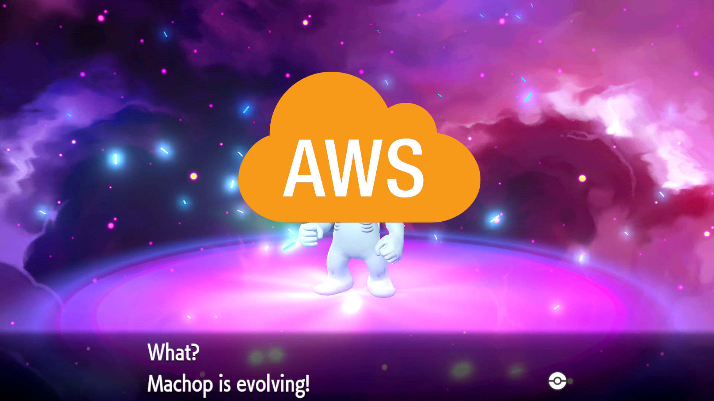
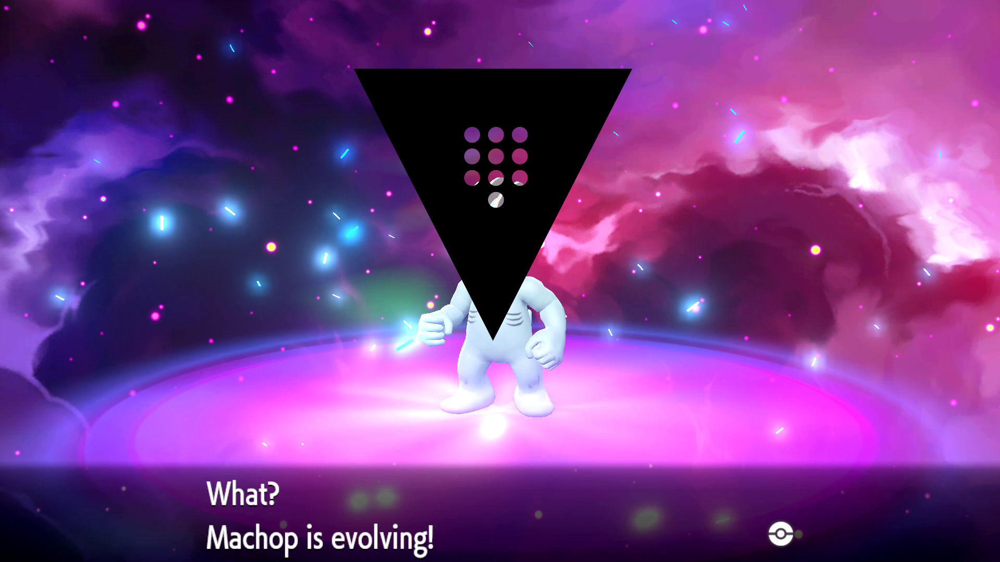

# Agenda

::: incremental

- What is IRSA
- Why you should care
- How it works
- Limits
- Next steps

:::

# Disclaimer


**LICENSE:** [CC-BY-4.0](https://creativecommons.org/licenses/by/4.0/)

I do not speak on behalf of my employer.

My views may not reflect those of my employer.

Media relations @ [elevancehealth.com/contact-us](https://www.elevancehealth.com/contact-us).

# IRSA

::: incremental

- IAM Roles for Service Accounts (IRSA)
- Ties a kube service account to an AWS IAM role

:::

<aside class="notes">

- IRSA is an indispensable tool for communicating between a kube cluster and the Amazon cloud platform
- It is a 1:1 translation of the Kubernetes identity to an AWS identity
- 2-way handshake to establish "trust"

</aside>

## Use cases

- `external-dns` w/ Route53
- CSI driver for AWS' Elastic Block Store (EBS)
- Application stores blobs in S3 buckets

## Kubernetes Config

```yaml
apiVersion: v1
kind: ServiceAccount
metadata:
  name: my-workload
  annotations:
    eks.amazonaws.com/role-arn: >
      arn:aws:iam::111122223333:role/my-role
```

## IAM Config

```json
{
  "Version": "2012-10-17",
  "Statement": [{
    // ...
  }]
}
```

<aside class="notes">

- we all know what an IAM policy looks like?

</aside>

---

```json
{
  "Effect": "Allow",
  "Action": "sts:AssumeRoleWithWebIdentity",
  "Principal": {
    "Federated":
      "arn:aws:iam::111122223333:oidc-provider/YOUR_OIDC_URI"
  },
  "Condition": {
    "StringEquals": {
      "YOUR_OIDC_URI:sub": "system:serviceaccount:KUBE_NS:KUBE_SA",
      "YOUR_OIDC_URI:aud": "sts.amazonaws.com"
    }
  }
}
```

---

::: incremental

- `YOUR_OIDC_URI`
  - &rarr; `oidc.eks.us-east-1.amazonaws.com/id/EXAMPLED539D4633E53DE1B71EXAMPLE`
- `KUBE_NS`
  - &rarr; `breakfast-table`
- `KUBE_SA`
  - &rarr; ~~`default`~~
  - &rarr; `waffles`

:::

---

```json
{
  "Effect": "Allow",
  "Action": "sts:AssumeRoleWithWebIdentity",
  "Principal": {
    "Federated":
      "arn:aws:iam::111122223333:oidc-provider/YOUR_OIDC_URI"
  },
  "Condition": {
    "StringEquals": {
      "YOUR_OIDC_URI:sub": "system:serviceaccount:KUBE_NS:KUBE_SA",
      "YOUR_OIDC_URI:aud": "sts.amazonaws.com"
    }
  }
}
```

---

```json
{
// ...
"Principal": {
  "Federated": "arn:aws:iam::111122223333:oidc-provider/YOUR_OIDC_URI"
},
// ...
}
```

### OIDC Provider

```terraform
data "tls_certificate" "eks" {
  url = aws_eks_cluster.this.identity[0].oidc[0].issuer
}

resource "aws_iam_openid_connect_provider" "eks" {
  url             = aws_eks_cluster.this.identity[0].oidc[0].issuer
  client_id_list  = ["sts.amazonaws.com"]
  thumbprint_list = data.tls_certificate.eks.certificates[*].sha1_fingerprint
}
```

---

```json
{
// ...
"StringEquals": {
  // ...
  "YOUR_OIDC_URI:sub": "system:serviceaccount:KUBE_NS:KUBE_SA",
  // ...
}
// ...
}
```

### JWT

```json
{
  "iss": "https://kubernetes.cluster.local",
  "aud": "sts.amazonaws.com",
  "sub": "system:service:KUBE_NS:KUBE_SA"
}
```

---

```json
{
// ...
  "Action": "sts:AssumeRoleWithWebIdentity",
// ...
}
```

## Observations

::: incremental

- AWS SDKs seem to "just work" without `~/.aws/config`
- Magical
- Creds are fresh, never frozen

:::

---


## Limits

::: incremental

- Same-account only
- Trust policies everywhere
- Kube cluster &rarr; OIDC provider &rarr; IAM role

:::

<aside class="notes">

- unless `~/.aws/config` with `assume_role` cross-account
- scaling across 100's of accounts, 2-way handshakes... _HARD_
- several steps, only usable by this EKS cluster for AWS stuff

</aside>

# ...

---

<!--  -->



---

<!--  -->



# HashiCorp Vault

::: incremental

- Identity translator
  - Bring your own identity
  - Produces native identity
- Purpose-built

:::

<aside class="notes">

<!-- These are some speaker notes -->

- HashiCorp Vault is, canonically, an identity translator
  - esp. between systems that don't know about, or support your chosen identity system
  - absorbs complexity, exposing simple creds
- Not just Kube, not just AWS, much wider scope

</aside>

## Vault Agent Injector

::: incremental

- Feature of the Vault Helm chart
- Pod + annotations &rarr; Pod + Vault Agent
- Agent templates a config file
- Contents of file look like `~/.aws/credentials`

:::

<aside class="notes">

- Whatever your orchestration:
  - Deployment, DaemonSet, StatefulSet
  - Job, CronJob
- Observes annotations on all pods coming in
  - modifies if relevant annotations exist
  - modifies according to annotations as settings

</aside>


## AWS SDK

::: incremental

- Consistency!
  - `~/.aws/credentials`
  - `~/.aws/config`
  - INI syntax
- Environment variables!
  - `AWS_PROFILE`
    - `[default]` or `[db-access]`
  - `AWS_SHARED_CREDENTIALS_FILE`
    - `~/.aws/credentials` &rarr; `/vault/secrets/<NAME>`

:::

## Inject!

---

```yaml
vault.hashicorp.com/agent-inject: 'true'
vault.hashicorp.com/agent-cache-enable: 'true'
vault.hashicorp.com/role: 'my-kube-auth-role'
```

---

```yaml
vault.hashicorp.com/agent-inject-secret-awscreds: 'aws/sts/s3-rw'
vault.hashicorp.com/agent-inject-template-awscreds: |
  {{- with secret "aws/sts/s3-rw" "role_session_name=vault-agent" -}}
  [default]
  aws_access_key_id = {{ .Data.access_key }}
  aws_secret_access_key = {{ .Data.secret_key }}
  aws_session_token = {{ .Data.security_token }}
  {{- end }}
```

---

```yaml
- name: rss-reader
  image: docker.io/nickchase/rss-php-nginx:v1
  env:
    # ...
    - name: AWS_SHARED_CREDENTIALS_FILE
      value: /vault/secrets/awscreds
    # ...
```

## GitHub

[TheLonelyGhost/example-vault-irsa](https://github.com/TheLonelyGhost/example-vault-irsa)

# Who Am I?


[www.thelonelyghost.com](https://thelonelyghost.com)
